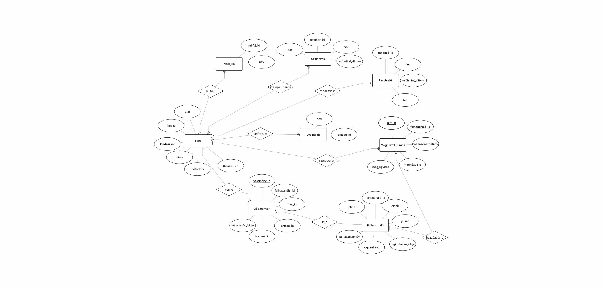

# CinemaTár - Projekt Dokumentáció

**Szerveroldali programozás - 2025 őszi félév**

---

## 1. Specifikáció

### Projekt célja
Egy modern, felhasználóbarát filmadatbázis kezelő webalkalmazás és REST API fejlesztése, amely lehetővé teszi filmek böngészését, keresését, értékelését és adminisztrálását különböző jogosultsági szintekkel.

### Funkcionális követelmények

**Vendég felhasználók számára:**
- Filmek böngészése a főoldalon (kiemelt slider + carousel)
- Filmek keresése cím, műfaj, színész vagy rendező alapján
- Film részleteinek megtekintése
- Vélemények olvasása
- Regisztráció és bejelentkezés

**Bejelentkezett felhasználók számára:**
- Minden vendég funkció
- Saját profil szerkesztése
- Jelszó módosítása
- Vélemények írása filmekhez (1-5 csillag + szöveges értékelés)
- Filmek megjelölése "megnézettként"
- Saját megnézett filmek listájának megtekintése

**Moderátorok számára:**
- Minden bejelentkezett felhasználói funkció
- Új filmek hozzáadása
- Meglévő filmek szerkesztése
- Filmek törlése
- Képek feltöltése (URL vagy fájl)

**Adminisztrátorok számára:**
- Minden moderátori funkció
- Felhasználók szerepköreinek módosítása
- Felhasználók törlése
- Teljes rendszer felügyelet

### Nem-funkcionális követelmények

**Biztonság:**
- BCrypt jelszó hashelés
- Session-alapú autentikáció
- Prepared statements SQL injection ellen
- Jogosultság-ellenőrzés minden védett végponton
- Fájl feltöltés validáció (típus, méret)

**Teljesítmény:**
- Lapozás a film listáknál (max 20 elem/oldal)
- Optimalizált adatbázis lekérdezések (JOIN-ok helyett indexek)
- Kliens oldali cache (localStorage témabeállítás)

**Használhatóság:**
- Responsive design (mobil, tablet, desktop)
- Intuitív navigáció
- Sötét/világos téma választás
- Vizuális visszajelzések (hover, loading, error státuszok)

**Karbantarthatóság:**
- MVC architektúra (Model-View-Controller)
- Egyértelmű kódszervezés (controllers, models, includes)
- Részletes dokumentáció

---

## 2. Adatbázis modell (Rendszerterv)

### ER-diagram



### Fő táblák

**felhasznalo** - Felhasználói adatok (admin/moderator/user szerepkörök)  
**film** - Filmek alapadatai (cím, év, időtartam, leírás, poszter)  
**szineszek** - Színészek (név, születési dátum, bio)  
**rendezok** - Rendezők (név, születési dátum, bio)  
**mufajok** - Műfajok (horror, sci-fi, dráma, stb.)  
**orszagok** - Gyártó országok  
**velemenyek** - Felhasználói értékelések filmekhez  
**megnezett_filmek** - Felhasználók megnézett filmjei (N:M kapcsolótábla)

### Kapcsolótáblák

- `film_mufaj` - Film ↔ Műfaj (N:M)
- `film_szineszek` - Film ↔ Színész (N:M)
- `film_rendezok` - Film ↔ Rendező (N:M)
- `film_orszagok` - Film ↔ Ország (N:M)
- `megnezett_filmek` - Felhasználó ↔ Film (N:M)

---

## 3. API végpontok

| Metódus | Végpont | Leírás | Jogosultság |
|---------|---------|--------|-------------|
| POST | `/users/register` | Regisztráció | - |
| POST | `/users/login` | Bejelentkezés | - |
| GET/PUT | `/users/profile` | Profil lekérése/módosítása | Bejelentkezett |
| PUT | `/users/password` | Jelszó módosítása | Bejelentkezett |
| GET | `/films` | Filmek listája | - |
| POST/PUT/DELETE | `/films` | Film CRUD | Moderátor+ |
| GET/POST | `/reviews` | Vélemények | - / Bejelentkezett |
| GET/POST/DELETE | `/watched-films` | Megnézett filmek | Bejelentkezett |
| GET/PUT/DELETE | `/users` | Felhasználó kezelés | Admin |

**További végpontok:** `/actors`, `/genres`, `/directors`, `/countries`

---

## 4. Telepítési és üzemeltetési útmutató

### 1. XAMPP telepítése
1. Töltsd le: https://www.apachefriends.org/
2. Telepítsd (Apache, MySQL, PHP, phpMyAdmin)
3. Indítsd el az Apache-ot és MySQL-t

### 2. Projekt másolása
```
C:\xampp\htdocs\php\PHP projekt\Szerveroldali-programozas-projekt\
```

### 3. Adatbázis importálása
1. Nyisd meg: `http://localhost/phpmyadmin`
2. Importáld: `backend/database/filmadatbazis.sql`
3. Ellenőrzés: `film` adatbázis, 11 tábla, tesztadatok

### 4. Indítás
- **API:** `http://localhost/php/PHP projekt/Szerveroldali-programozas-projekt/public/films`
- **Frontend:** Nyisd meg `frontend/index.html` böngészőben

### 5. Frontend oldalak

| Fájl | Leírás | Jogosultság |
|------|--------|-------------|
| `index.html` | Főoldal kiemelt filmekkel és carousel | Mindenki |
| `kereses.html` | Filmkeresés + vélemények modal | Mindenki |
| `filmek.html` | Saját megnézett filmek listája | Bejelentkezett |
| `profil.html` | Profil szerkesztése | Bejelentkezett |
| `jelszo_modositas.html` | Jelszó módosítása | Bejelentkezett |
| `admin.html` | Film és felhasználó adminisztráció | Moderátor/Admin |
| `regisztracio.html` | Új felhasználó regisztráció | Vendég |
| `bejelentkezes.html` | Bejelentkezés | Vendég |

---

## 6. Tesztelési adatok

### Teszt felhasználók

| Email | Jelszó | Jogosultság |
|-------|--------|-------------|
| admin@cinematar.hu | `admin123` | Admin |
| moderator@cinematar.hu | `moderator123` | Moderátor |
| user@test.com | `user123` | User |

### Postman tesztek
1. Importáld: `tesztek/Film-API.postman_collection.json`
2. Importáld: `tesztek/Film-API.postman_environment.json`
---

## 6. UI/UX Funkciók

- **Dinamikus főoldal:** Kiemelt filmek slider (automatikus váltás) + legújabb filmek carousel (kétirányú navigáció)
- **Téma váltás:** Sötét/világos mód (localStorage perzisztencia)
- **Megnézett filmek:** Jelölés checkbox-szal, saját lista megtekintése (`filmek.html`)
- **Responsive design:** Mobil, tablet, desktop optimalizált

---

## 7. Felhasználói dokumentáció

### Jogosultságok

| Funkció | Vendég | User | Moderátor | Admin |
|---------|--------|------|-----------|-------|
| Filmek böngészése | Igen | Igen | Igen | Igen |
| Keresés | Igen | Igen | Igen | Igen |
| Profil szerkesztése | - | Igen | Igen | Igen |
| Jelszó módosítása | - | Igen | Igen | Igen |
| Film CRUD | - | - | Igen | Igen |
| Képfeltöltés | - | - | Igen | Igen |
| Felhasználó kezelés | - | - | - | Igen |

